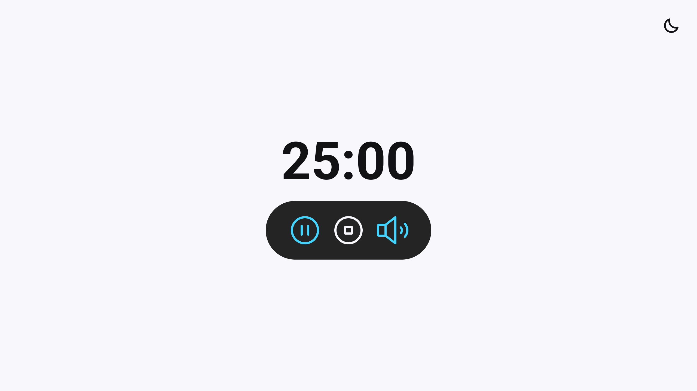

# Focus Timer

Projeto "Focus Timer" do Explorer Rocketseat - Stage 05

## 🚀 Tecnologias

Esse projeto foi desenvolvido com as seguintes tecnologias:

- HTML e CSS
- JavaScript

## 💻 Projeto

O FocusTumer é um Timer desenvolvido em Javascript com possibilidade de alternar entre dark/light mode e música de fundo.

- [Acesse o projeto finalizado, online](https://brunobrsl.github.io/focus-timer)

## 🔗 Links
